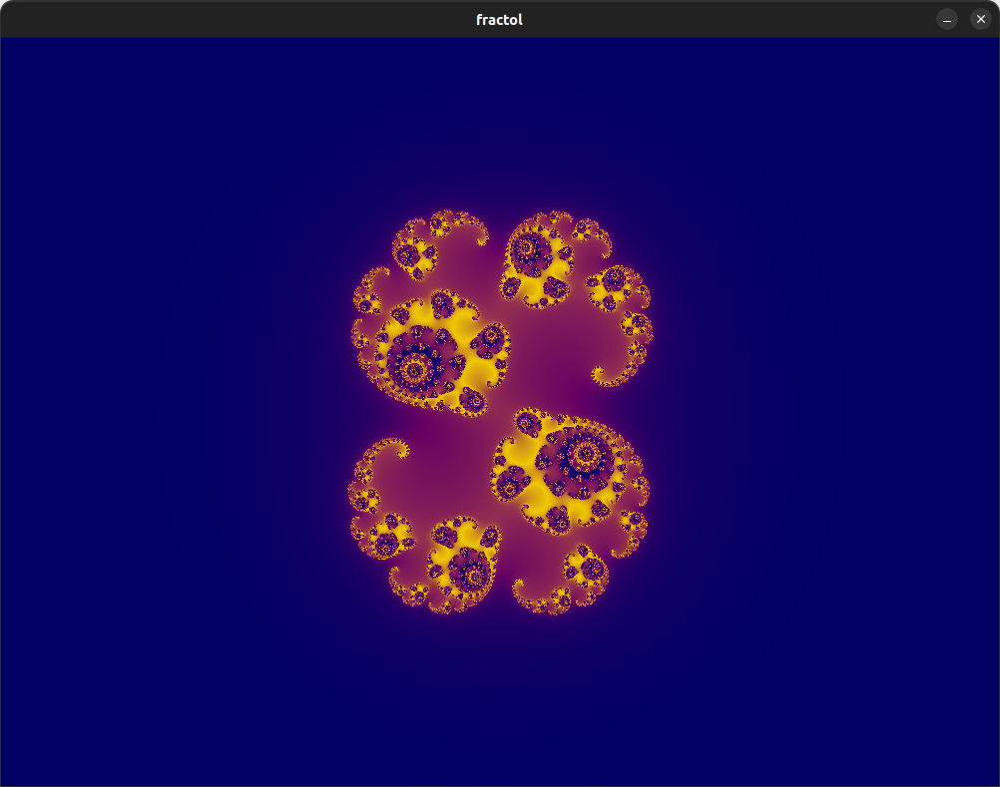
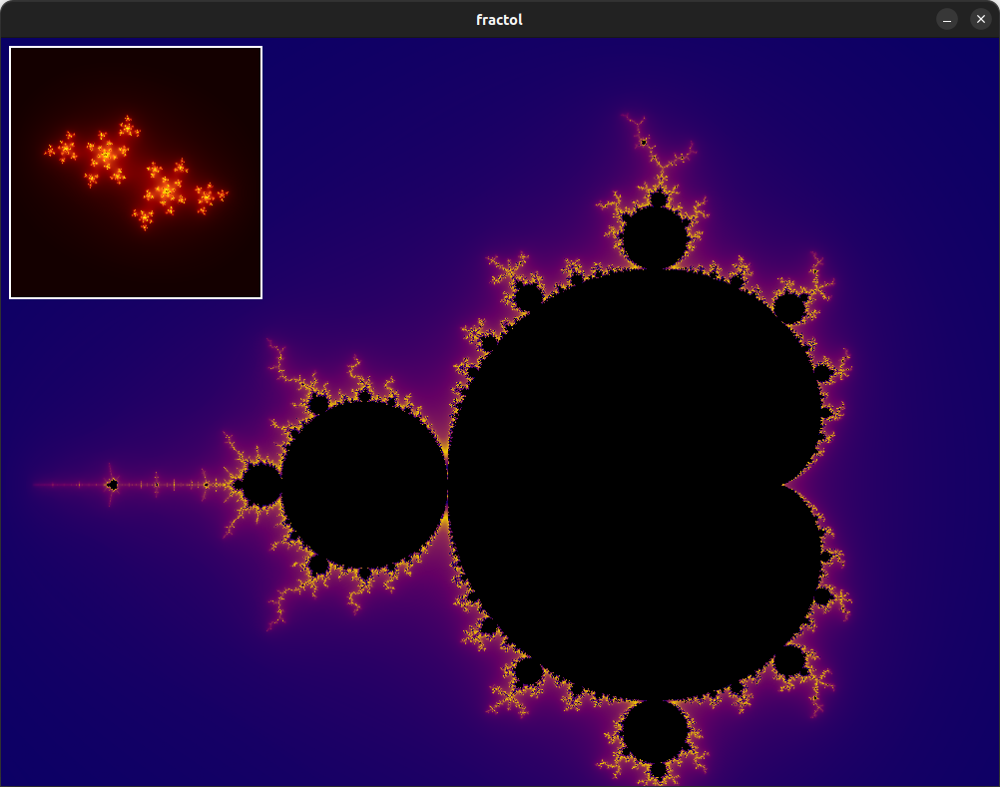
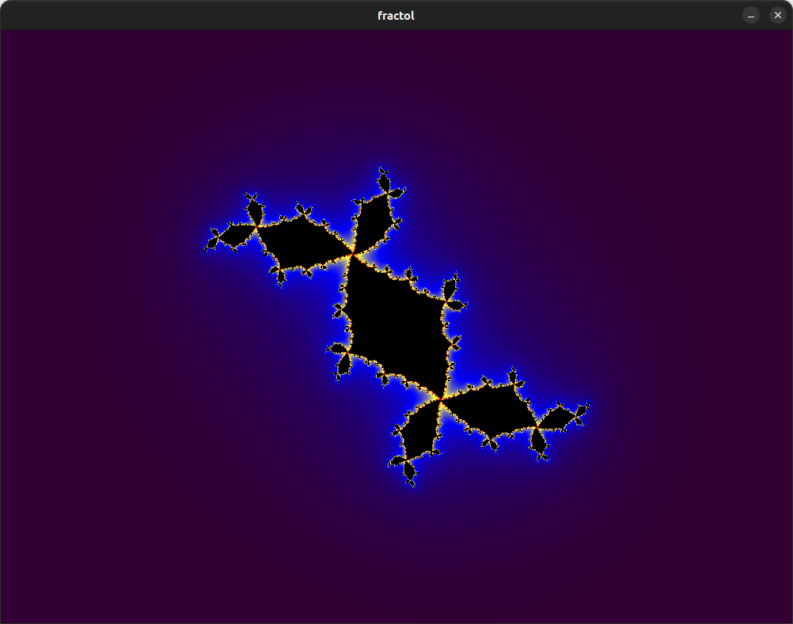
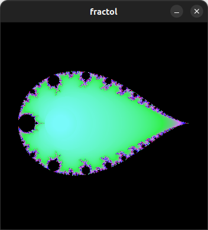
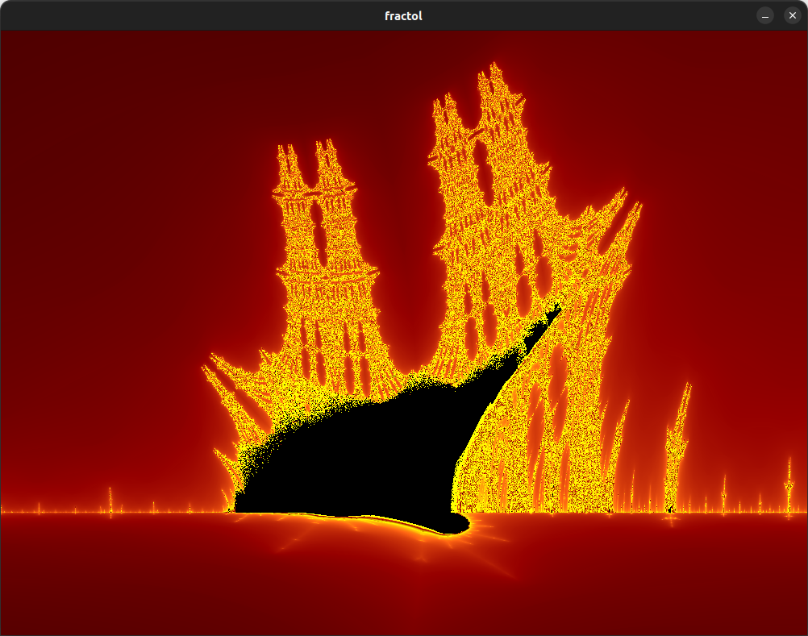

# Fract-ol (school 42 project)

## Project overview
A C-based project aimed at learning low-level graphic library usage by drawing fractals, including the Julia set and the Mandelbrot set.

## Contents

- [Description](#description)
- [Installation](#installation)
- [Usage](#usage)
- [Acknowledgments](#acknowledgments)
- [License](#license)
- [Screenshots](#screenshots)



## Description
This project is designed to introduce to the fundamentals of using a low-level graphic library in C. The main objective is to create visual representations of fractals, focusing on the Julia set and the Mandelbrot set as the mandatory components. I learned how to manage pixels, handle complex mathematical calculations, and render intricate fractal patterns. The project serves as a hands-on approach to understanding graphic algorithms and exploring the fascinating world of fractals.

## Installation

1. **Clone the git :**
   ```bash
   git clone https://github.com/Kernicterus/fract-ol_42.git
   ```

2. **Clone the git of the minilibx at the root of the repo:**
   ```bash
   cd fract-ol_42 && git clone https://github.com/42Paris/minilibx-linux.git
   ```

3. **Make :**
   ```bash
   make bonus
   ```

## Usage

4. **Run the program :**
   ```bash
   ./fractol
   ```

## Aknowledgments
- **42 school**: I wish to express my sincere appreciation to 42 school for imparting essential knowledge and skills in coding. 

## License
This project is licensed under the MIT License. See the [LICENSE file](LICENSE.md) for more details.

## Screenshots
Mandelbrot :  


An other Julia set  


Mandelbrot exp -1 :  


The burning ship :  
